# **期末项目 —— 玩转 Shadertoy**

### **Part0: 选题**

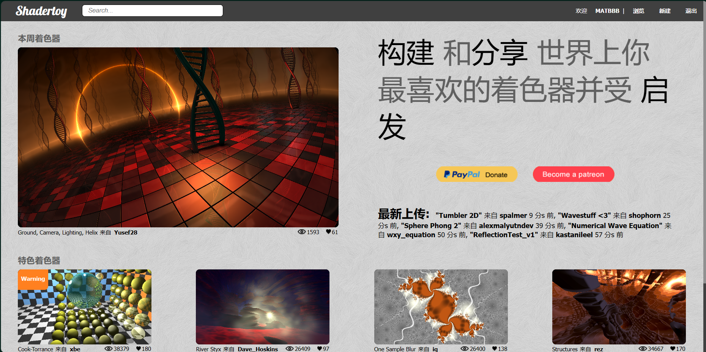

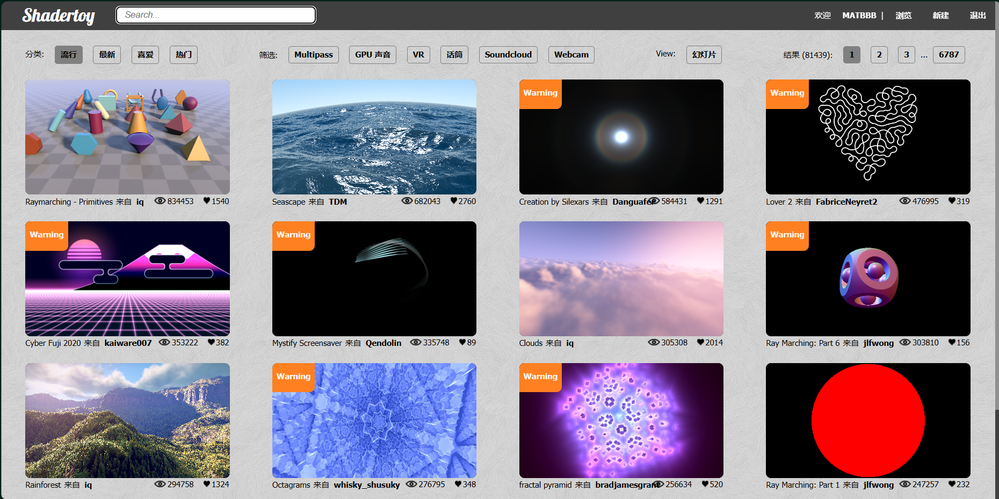

​	 你需要多少个三角形来表示下图所示的场景并进行渲染？答案是仅仅需要两个，这个两个三角形其实构成了恰好覆盖整个屏幕空间的四边形，所有的一切都是在屏幕空间的像素上进行。回顾光线追踪，它也是这样，在每个屏幕空间的像素上发射光线然后与场景中的物体求交然后反射、折射、散射，最后返回该追踪光线得到的辐射率。但这里要使用的是与 ray tracing 类似的技术——ray marching，即光线步进。场景中的物体采用距离场表示。这里有个教程详细地教你如何使用距离场表示几何图形，以及如何在片段着色器中实时渲染他们！注意，此项目要求你使用 GPU 的着色器，你可以使用 OpenGL/DirectX/Vulkan 来完成，甚至也可以直接在 ShaderToy 上完成。此选题难度稍微有点大，实现什么完全靠自身想象力，但 ShaderToy 上有很多代码可以参考。

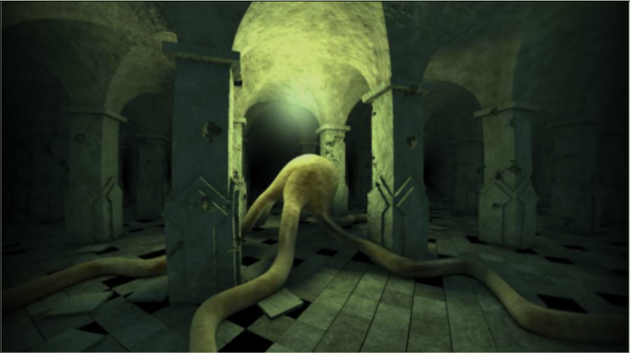

### **Part1: 摘要**

我们在 Shadertoy 和 GLSL 的支持下完成了一个俯瞰山野的动态渲染场景，并且我们模拟了一天日月升落的过程，还添加了红旗、火箭等物体丰富渲染场景。该项目涉及了光线步进、SDF 距离场、光照计算、阴影计算、像素级渲染、摄像头位置变换、物体位置变换等等技术。最终完成的渲染视频附在文件夹中，静态渲染效果截图如下所示：

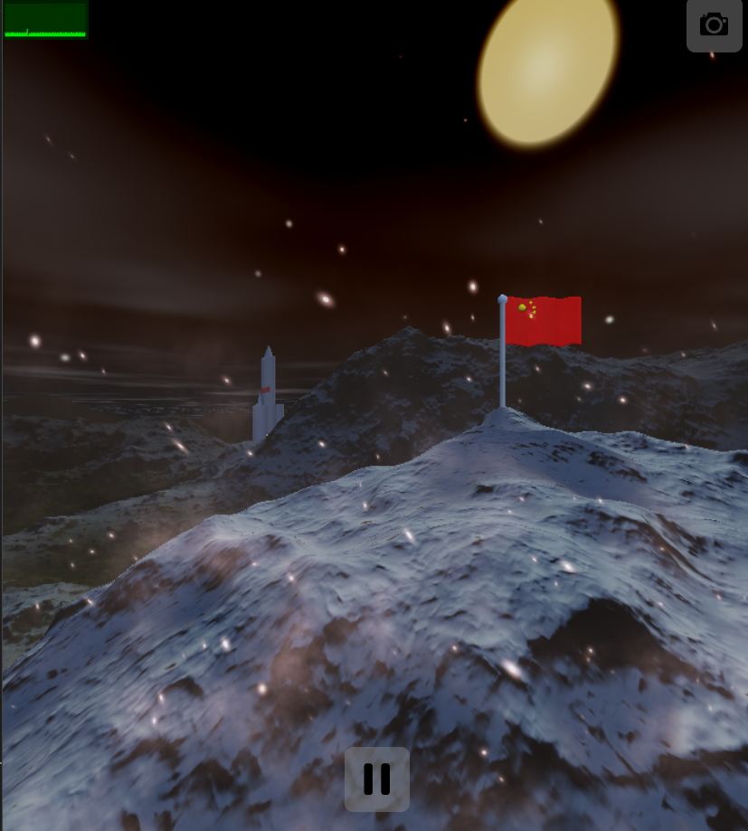

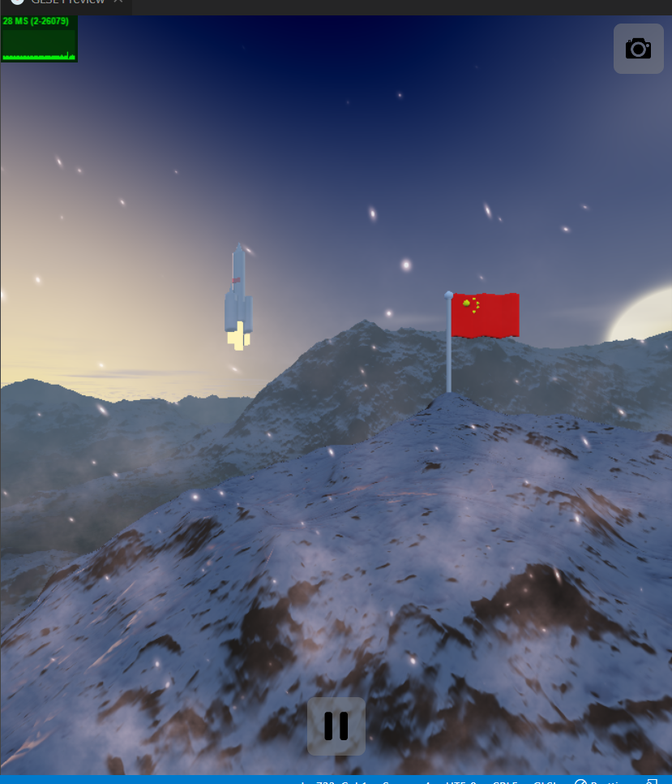

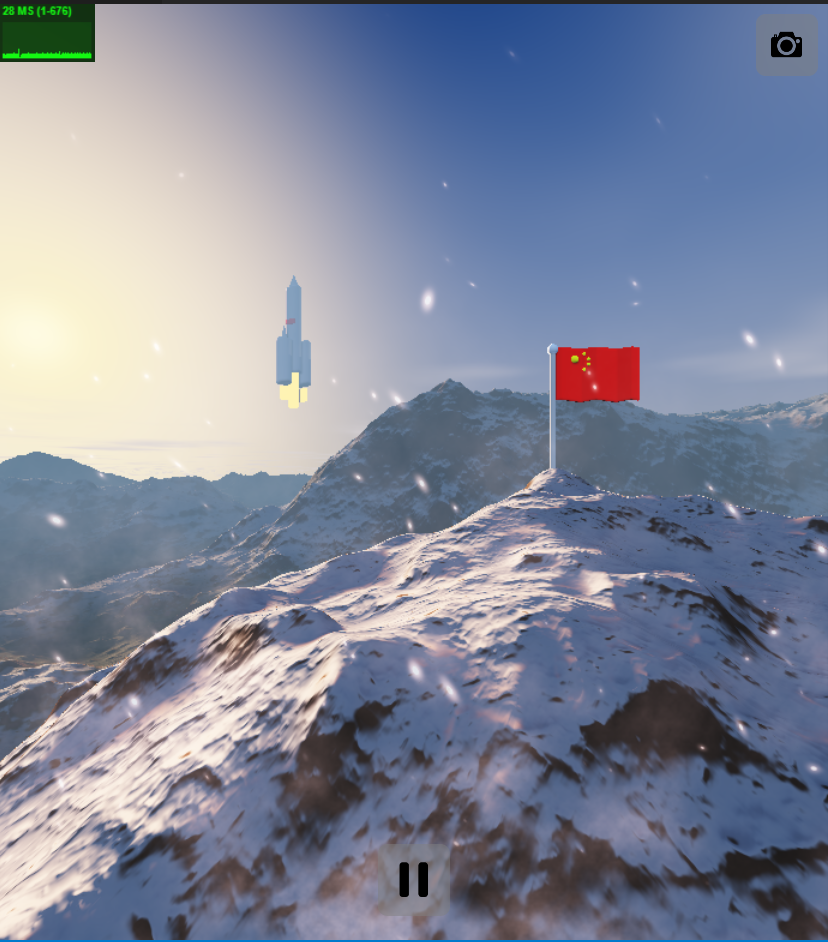

### **Part2: Raymarching 光线步进**

#### 原理解释

   光线步进是一项与光线追踪相似的技术，从摄像机位置向屏幕上的每个像素点发射光线，光线按照一定步长前进，每次前进以后计算当前点与场景中物体的最短距离 d，如果 d 小于一个自定义的极小值，说明当前光线击中了场景表面，返回击中场景的该光线向量的长度，以及根据该向量击中的物体类型，返回相应的颜色值并显示在 uv 屏幕上；否则，检查 d 是否已经大于预设的最大距离或最大步进次数，如果是的话，说明光线此时步进至遥远的背景中了，无法击中地理表面上的场景，此时也将返回该光线的长度，并根据长度值>最大距离的判断得知击中类型为“背景”，然后根据需要为背景着色即可；如果以上判断皆为否，也即光线既还没击中物体表面，也还没有深入到背景空间，此时当前点将会保持原方向不变，并继续增加 d 长度，接着回到计算与场景最短距离 d 的步骤，重复上述步进过程，直至击中物体表面或超出阈值，深入到背景空间为止

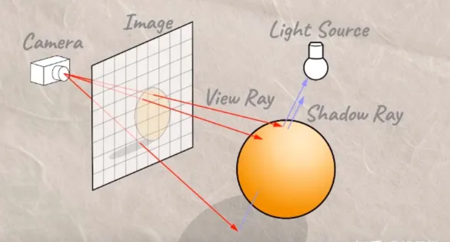

光线步进实现代码：

```glsl
vec2 rayMarch(vec3 ro, vec3 rd, float tmin, float tmax) {
    float t = tmin;
    float mytype = 3.0;
    for(int i = 0; i < MAX_ITER; i++) {
        vec3 p = ro + t * rd;
        float d = map(p).x;
        float retype = map(p).y;
        if(abs(d) < EPSILON * t || t > tmax){
            mytype = retype;
            break;
        }
        t += 0.3 * d;
    }
    return vec2(t, mytype);
}
```

==注：修改代码393、394行的注释可以选择摄像机是否进行移动==

### **Part3: SDF**

   SDF（Signed Distance Function，符号距离函数），用于描述一个点到某个几何形状的最近表面的距离，并同时提供了该点位于该几何表面的内部或外部的信息。SDF 表示为一个函数，接受空间中的任意点作为输入，然后返回该点到该函数描述的几何物体最近表面的距离，若该点在最近表面的外部，则返回正的距离值；若在最近表面的内部，则返回负的距离值。

 **对 SDF 的原理解释**：以球体的 sdf 函数为例进行说明，球体 sdf 函数如下：

```glsl
//球sdf
float sdfSphere(in vec3 p, float r){
    return length(p) - r;
}
```

   函数的输入参数`vec3 p`是输入坐标，表示当前步进到的世界坐标点，`float r`表示球体的半径。返回值为`length(p)-r`,表示当前点 p 的向量长度与球最近表面之间距离。假设我们希望在世界坐标为（1.，1.，1.）的位置布置一个半径为 0.5 的球，将 p 点加上偏移量得到的向量`p + vec3(-1., -1., -1.)`表示为 q，此时 sdf 函数返回值为`length(q)-r`，即 q 向量的长度与半径的差值，也即当前步进点与球最近表面的距离。

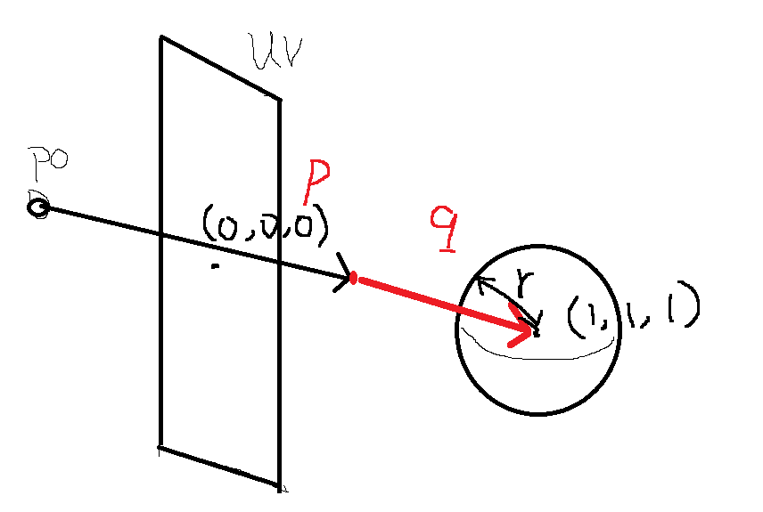

   编写三维物体的 SDF 函数是一个相当具有挑战性的过程，首先在 shadertoy 的实时渲染中，需要在有限的计算资源内求解 SDF 函数，这对 SDF 函数的复杂度和精度提出了限制；其次描述复杂形状的数学模型需要运用到高级的几何知识，如曲面方程、参数化表示和复杂的数学运算；再者为了计算特定形状的 SDF 函数，还需要深入了解期望形状的特性和数学描述。因此在 SDF 函数的计算中，我们更多地参考了以下网站进行 sdf 函数的设计：

[sdf]: https://iquilezles.org/articles/distfunctions/

 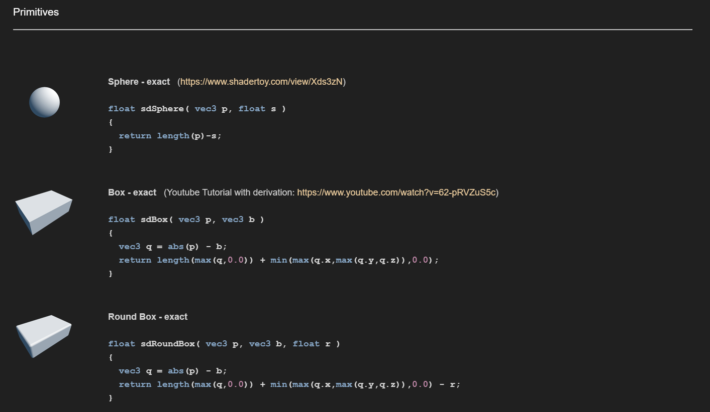


 在我们的实现中，**圆柱体**的 sdf 如下所示：

```glsl
//圆柱sdf
float sdfCappedCylinder( vec3 p, float h, float r ){
  vec2 d = abs(vec2(length(p.xz),p.y)) - vec2(r,h);
  return min(max(d.x,d.y),0.0) + length(max(d,0.0));
}
```

 **长方体**的 sdf：

```glsl
float sdBox( vec3 p, vec3 b ){
    p.x += 0.012*(pow((-322.3 - p.z)/4., 1.0))*sin((abs(fract(p.z * 0.3) - 0.5) * 4.*abs(fract(iTime) - 0.5)));
    p.y += 0.008*(pow((-322.3 - p.z)/4., 1.0))*sin((abs(fract(p.z * 0.3) - 0.5) * 4.*abs(fract(iTime) - 0.5)));
    vec3 q = abs(p) - b;
    return length(max(q,0.0)) + min(max(q.x,max(q.y,q.z)),0.0);
}
```

 **圆锥**的 sdf：

```glsl
float sdCappedCone( vec3 p, float h, float r1, float r2 )
{
    p.y -=  2. * pow(iTime + 1., 1.2);
    vec2 q = vec2( length(p.xz), p.y );
    vec2 k1 = vec2(r2,h);
    vec2 k2 = vec2(r2-r1,2.0*h);
    vec2 ca = vec2(q.x-min(q.x,(q.y<0.0)?r1:r2), abs(q.y)-h);
    vec2 cb = q - k1 + k2*clamp( dot(k1-q,k2)/dot(k2,k2), 0.0, 1.0 );
    float s = (cb.x<0.0 && ca.y<0.0) ? -1.0 : 1.0;
    return s*sqrt( min(dot(ca,ca),dot(cb,cb)) );
}
```

 	根据我们想要的变换效果，可以在 sdf 函数中对点的坐标进行变换操作，如圆锥中的 `p.y -=  2. * pow(iTime + 1., 1.2);`表示圆锥会随着时间向上移动。使用基本的 sdf 函数进行基础图形的拼合以及变换，我们可以制造出国旗、火箭、山体等等复杂的三维物体，这些物体的详细制作过程将会在后面的部分提及。制造好这些物体以后，将物体变换至世界空间的正确位置，在光线步进的过程中通过 map 函数，计算当前点离哪个创造的物体最接近，返回点和此物体的距离以及此物体的类型

 比较距离的**OpU**函数，返回两个距离中较小的即可：

```glsl
vec2 OpU(in vec2 sdf1,in vec2 sdf2){
    if(sdf1.x < sdf2.x) return sdf1;
    else return sdf2;
}
```

​	 **map**函数，计算当前点离哪个创造的物体最接近，返回点和此物体的距离以及此物体的类型：

```glsl
vec2 map(in vec3 p) {
    //x负越大 后  y负越大 上   z负越大 右
    vec2 d;
    d = flag(p); //国旗
    d = OpU(d, rocket(p, vec3(-400., -15.- ground(p.xz), -190.)));
    d = OpU(d, vec2(sdfMountain(p),2.)); // 2代表山
    return d;
}
```

### **Part4: Terrain**

 	众所周知，山体地形是具有强烈随机性的。而我们在山体的制作中则使用了随机数生成以及噪声插值的方法，在最后地形的优化中丰富了地面细节以及山体高度

**随机数生成**：
	这里我们使用无理数来生成随机数，其原理是，对于一个无理数，其最前面几位可能有规律，但是从小数部分开始，越往后移，数字的随机性就越大，所以我们可以用 sin 函数生成一个随机数，然后将这个数乘以一个较大的数让其向前移，再取其小数部分，这样我们就得到了一个随机数

具体代码如下所示：

```glsl
float random(vec2 pos) {
vec2 p2 = 95.1876653 * fract(pos * 10.1321513);
return fract((p2.x + p2.y) * p2.x * p2.y);
}
```

**噪声插值**：
在得到随机数之后，该如何生成山体呢？如果我们通过随机数生成一个连续的函数，那么我们就可以得到一个连续的地形

 例子如下：
 	对于一维的情况，如果我们先对 x 取整数部分，然后再对该 x 取随机数，生成的效果如下：

 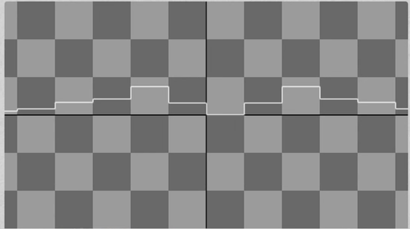

​	 如果我们先对 x 取小数部分，然后输出其小数，效果如下：
 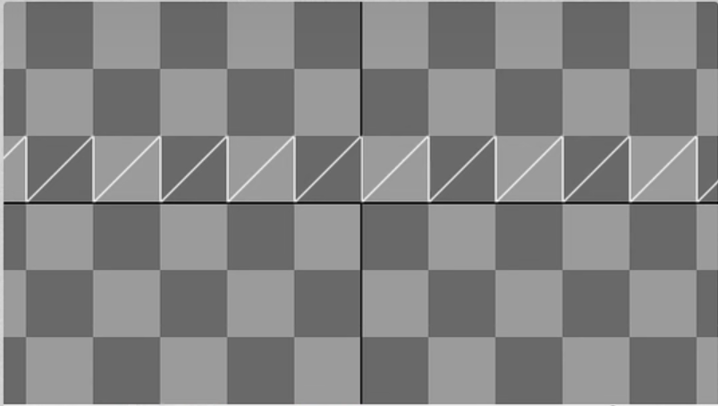

​	 可以看出，如果我们此时用小数部分对于整数部分生成的随机数进行插值，那么就可以生成一个连续的函数：

 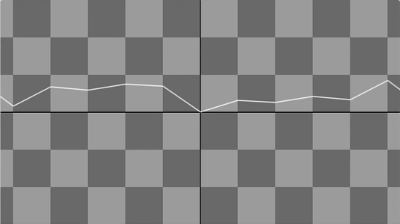

 对于山脉来说也同理：

​	 对于二维的情况就是先对 x，y 取整数部分，然后用小数部分对于整数部分生成的随机数点进行插值，最终即可得到山体的连续函数

 代码如下：

```glsl
vec3 noise(vec2 pos) {
vec2 i = floor(pos);
vec2 f = fract(pos);
vec2 u = f * f * (3.0 - 2.0 * f);
vec2 du = 6. * u * (1. - u);

float a = random(i);
float b = random(i + vec2(1.0, 0.));
float c = random(i + vec2(0.0, 1.0));
float d = random(i + vec2(1.0, 1.0));

return vec3(a + (b - a) * u.x * (1. - u.y) +
    (c - a) * (1. - u.x) * u.y +
    (d - a) * u.x * u.y,
    du * (vec2(b - a, c - a) +(a - b - c + d) * u.yx));
}
```

**山体形状优化**：
	由上面一维的插值图片可以看出，插值之后的函数虽然是光滑连续的，但是没有山体那种高低起伏的感觉，所以我们需要对该地形进行一定的旋转缩放叠加使其更接近于现实的山体地形，代码如下：

```glsl
float ground(vec2 x) {
    vec2 p = 0.003 * x;
    float a = 0.;
    float b = 1.;
    vec2 d = vec2(0);
    for(int i = 0; i < 8; i++) {
        vec3 n = noise(p);
        d += n.yz;
        a += b * n.x / (1. + dot(d, d));
        p = rotate2D * p * 2.;
        b *= 0.5;
    }
    return 120. * a;
}
```

​	最后得到的山体地形如下：
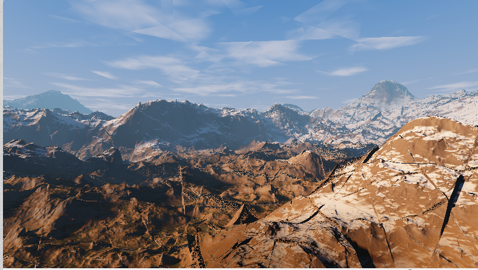

### **Part5: Sun、 Moon、 Stars**

​	 对于太阳、月亮和星星，我们并没有将其设计为 SDF 表示的物体，而是通过纯数学的设计对天空进行不同的动态着色。

**Sun：**

​	 我们通过视线向量和太阳方向向量的关系，为太阳赋予多层次的视觉效果。首先我们获取两向量（已归一化为单位向量）的点积，然后对其作不同程度的次幂运算，显然越高次幂对两向量方向相互接近的要求越高。也就是说越高次幂就越接近太阳的中心。因此我们在高次幂中为天空叠加一个接近太阳中心实际颜色的颜色，而低次幂则叠加一个接近日晕颜色的颜色，当然不止这两个层次，我们在中间还设计了其它层次以丰富太阳的观感。

​	 不过在实现中我们发现这样直接在天空的颜色下叠加太阳颜色往往会出现我们并不想要的结果，所以我们也根据视线向量和太阳方向向量的关系，对天空的颜色作了一定程度的压制，越接近太阳就压制的越大，距离太阳一定距离后就几乎没有压制。

​	 对太阳的位置运动设计是一个很简单的基于 iTime 的思想，我们固定深度，并且让横纵坐标成圆形变化，一旦它进入天空范围就开始渲染，移动出了天空的范围就不再渲染，以此达到太阳上山下山的效果。

​	 对太阳的颜色光照强度变化设计建立在位置运动的基础上，最主要是根据位置的纵坐标来进行变化，此处我们运用了很多数学的方法进行尝试最终达到了极为接近真实世界的太阳变化效果。

 具体代码如下所示：

```glsl
// sun
        col *= (1. - pow(sundot, 64.0));
        col += 0.4 * vec3(0.9, 0.9, 0.7 * min(1., (lightscale + 0.1))) * pow(sundot, 64.0) * min(1., (lightscale + 0.1));//光晕
        col += 0.4 * vec3(1., 0.8, 0.7 * min(1., (lightscale + 0.1))) * pow(sundot, 64.0) * min(1., (lightscale + 0.1));//太阳高光
        col += 0.4 * vec3(1., 0.7, 0.5 * min(1., (lightscale + 0.1))) * pow(sundot, 512.0) * min(1., (lightscale + 0.1));
        col += 0.5 * vec3(1, 0.7, 0.5 * min(1., (lightscale + 0.1))) * pow(sundot, 1024.0) * min(1., (lightscale + 0.1));
```

**Moon：**

 	对月亮的设计几乎完全仿照太阳的设计进行，而且考虑到月亮在现实中我们一般也不会观察到它颜色强度的变化，所以我们并没有设计月亮颜色强度变化。具体实现中我们让月亮刚好处于太阳运动的圆的相对位置，并且运动方向和太阳运动方向相反，以此达到昼夜轮转的效果。

​	 具体代码如下所示：

```glsl
//moon
        if (lightscale < 0.6) {
            col *= (1. - pow(moondot, 1024.0));
            col += 1. * vec3(0.9, 0.8, 0.5) * pow(clamp(moondot+0.006, 0., 1.), 1024.0);
        }
```

**Stars：**

​	 对星星我们也是通过视线向量和星星方向向量的关系来进行着色。不过我们该在什么时候让星星出现呢？当然是夜晚月亮升起来的时候。但是直接用某个简单的 if 来判断会让星星的出现和消失太过于生硬，所以我们还是运用上了纯数学实现的渐变来对星星进行优化。

   在月亮升起到了一定程度（即太阳降落到了一定程度）时，星星开始逐渐出现，我们通过幂运算和初始值设计来让淡入淡出过程更符合实际观察以及美观。另外对于五个星星我们在 itime 数组中基于 iTime 设计了不同的时间以实现不同频率的闪烁效果。通过 sin 让这个效果只在-1 和 1 之间变化，不会随着 iTime 无限增长，然后又通过取绝对值避免染黑天空。

 具体代码如下所示：

```glsl
 //stars
        if(lightscale < 0.3){
            //归一化
            float starscale = pow(((0.3 - lightscale) / 0.3), 2.) + 0.01;
            //col += 2. * vec3(255./255., 255./255., 245./255.) * pow(stardot, 4096.0) * starscale + vec3(0.9, 0.9, 0.9) * 0.005;
            for(int i=0;i<5;i++){
                col +=  abs(sin(2.*itime[i])) * 1.1 *vec3(245./255., 250./255., 245./255.) * pow(clamp(stardot[i]-0.00001, 0., 1.), 60000.0) * starscale + vec3(.8, .8, .8) * 0.0015;
            }
        }
```

### **Part6: Flag**

国旗 sdf 设计：

1. 通过 `sdfCappedCylinder` 函数创建一个旗杆，该函数生成一个带有顶部和底部半径的圆柱体的 SDF。旗杆的位置和尺寸由 `p + vec3(-48, -95, -322)` 和参数 8.0（半径），0.3（高度）定义的
2. 在旗杆顶部添加一个小球，这是通过 `sdfSphere` 函数实现的，该函数生成一个球体的 SDF。小球的位置由 `p + vec3(-48, -103, -322)` 定义，半径为 0.5
3. 通过 sdBox 函数来添加一个矩形的红旗，该函数生成一个盒子的 SDF。红旗的位置和尺寸由 `p + vec3(-48, -100.5, -326.3)` 和 `vec3(0.15, 2.5, 4.0)`（尺寸）定义
4. 在旗子上添加五个星星。这些星星的位置是基于 `starBasePos`（基准位置）和一个数组 `starOffsets`（各个星星的位置偏移）计算的。星星的大小存储在 `starSizes` 数组中。对于每个星星，函数使用 `sdfSphere1` 生成星星的 SDF，并通过循环将它们添加到旗帜上

```glsl
vec2 flag(vec3 p)
{
    vec2 d = vec2(sdfCappedCylinder(p + vec3(-48, -95, -322), 8.0, 0.3), TYPE_qigan); // 旗杆

    d = OpU(d, vec2(sdfSphere(p + vec3(-48, -103, -322), 0.5), TYPE_qiu)); // 旗杆顶球

    d = OpU(d, vec2(sdBox(p + vec3(-48, -100.5, -326.3), vec3(0.15, 2.5, 4.0)), TYPE_hongqi)); // 红旗

    vec3 starBasePos = p + vec3(-47.5, -101.7, -324);
    float starSizes[5] = float[](0.35, 0.15, 0.15, 0.15, 0.15);
    vec3 starOffsets[5] = vec3[](vec3(0, 0, 0), vec3(0, -0.5, -0.9), vec3(0, 0, -1.3), vec3(0, 0.5, -1.3), vec3(0, 1.0, -0.9));

    for (int i = 0; i < 5; i++)
    { // 星星
        d = OpU(d, vec2(sdfSphere1(starBasePos + starOffsets[i], starSizes[i]), TYPE_xingxing));
    }

    return d;
}
```

国旗飘扬动态设计：

​	动态主要部分在旗面sdf处实现，为了营造出分段循环波动的仿真效果，我们对iTime以及位置的z坐标（屏幕横向）都取了小数部分，并且进行了诸多不同数学方程设计的尝试最后选用了下述的几个Factor函数，而飘扬的视觉效果主要体现在屏幕垂直方向和屏幕竖直方向上，我们对这两个坐标都基于Factor作了相应的位移以形成循环波动的视觉效果。

```glsl
float sdBox(vec3 p, vec3 b)
{
    float timeFactor = abs(fract(iTime) - 0.5);
    float zFactor = (abs(fract(p.z * 0.3) - 0.5) * 4. * timeFactor);
    float powFactor = pow((-322.3 - p.z) / 4., 1.0);

    p.x += 0.012 * powFactor * sin(zFactor);
    p.y += 0.008 * powFactor * sin(zFactor);

    vec3 q = abs(p) - b;
    return length(max(q, 0.0)) + min(max(q.x, max(q.y, q.z)), 0.0);
}
```


### **Part7: Rocket**

 火箭体的 sdf：使用了圆柱的 sdf 函数

```glsl
//火箭圆柱sdf
float sdfCappedCylinder_rocket( vec3 p, float h, float r ){
    p.y -=  2. * pow(iTime + 1., 1.2);
    vec2 d = abs(vec2(length(p.xz),p.y)) - vec2(r,h);
    return min(max(d.x,d.y),0.0) + length(max(d,0.0));
}
```

 火箭头的 sdf：使用了圆锥的 sdf 函数

```glsl
//火箭圆锥sdf
float sdCappedCone( vec3 p, float h, float r1, float r2 )
{
    p.y -=  2. * pow(iTime + 1., 1.2);
    vec2 q = vec2( length(p.xz), p.y );
    vec2 k1 = vec2(r2,h);
    vec2 k2 = vec2(r2-r1,2.0*h);
    vec2 ca = vec2(q.x-min(q.x,(q.y<0.0)?r1:r2), abs(q.y)-h);
    vec2 cb = q - k1 + k2*clamp( dot(k1-q,k2)/dot(k2,k2), 0.0, 1.0 );
    float s = (cb.x<0.0 && ca.y<0.0) ? -1.0 : 1.0;
    return s*sqrt( min(dot(ca,ca),dot(cb,cb)) );
}
```

 火箭红旗的 sdf：使用了长方体的 sdf 函数

```glsl
//旗面sdf
float sdBox_rocket( vec3 p, vec3 b ){
    p.y -=  2. * pow(iTime + 1., 1.2);
    vec3 q = abs(p) - b;
    return length(max(q,0.0)) + min(max(q.x,max(q.y,q.z)),0.0);
}
```

​      为了模拟火箭的升空过程，将 sdf 的 y 坐标改成随着时间向上移动，并且初始时上升较缓慢，随着时间上升变逐渐加快

​     火箭的整体 sdf 函数，将各种三维图形根据正确的位置和尺寸拼凑在一起：offset 为相对于世界坐标原点的偏移量，首先声明二维向量 d，d 的 x 分量表示 sdf 符号距离函数，y 分量表示击中的物体类型，用于后期着色阶段。火箭主体和副箭体为圆柱和圆锥的搭合，根据物体之间的相对位置调整坐标偏移量，设置合适的高度和半径即可。火箭尾部的火焰效果，由于本代码框架中并没有使用单独的光源实现，而是通过视线向量与光源位置向量的点积获取关于光源的聚焦系数，点积运算的 cos 夹角决定了视线只要越接近光源，该系数越大。火焰效果参照了这种实现，首先将火焰用合适形状的圆柱体代替，在着色阶段使用视线与圆柱位置的点积获取聚焦系数，并通过次幂运算叠加出高光效果实现火焰光源。

```glsl
//火箭sdf
vec2 rocket(vec3 p, vec3 offset){
    vec2 d;
    d = vec2(sdfCappedCylinder_rocket(p + offset, 40., 7.), TYPE_rocket); //主舰体
    d = OpU(d, vec2(sdBox_rocket(p + offset + vec3(10., -5., 0.), vec3(0.15,2.5,4.)), TYPE_hongqi));//红旗
    d = OpU(d, vec2(sdCappedCone(p + offset + vec3(0., -45., 0.), 10., 7., 0.01), TYPE_rocket)); //主箭头
    d = OpU(d, vec2(sdfCappedCylinder_rocket(p + offset + vec3(-7, 30., -7.), 20., 7.), TYPE_rocket)); //副舰体1
    d = OpU(d, vec2(sdCappedCone(p + offset + vec3(0., -25., 0.) + vec3(7, 30., 7.), 10., 4., 0.01), TYPE_rocket)); //副箭头1
    d = OpU(d, vec2(sdfCappedCylinder_rocket(p + offset + vec3(7, 30., 7.), 20., 7.), TYPE_rocket)); //副舰体2
    d = OpU(d, vec2(sdCappedCone(p + offset + vec3(0., -25., 0.) + vec3(7, 30., 7.), 10., 4., 0.01), TYPE_rocket)); //副箭头2
    d = OpU(d, vec2(sdfCappedCylinder_rocket(p + offset + vec3(0., 55., 0.), 16., 5.), TYPE_fire)); //火焰1
    d = OpU(d, vec2(sdfCappedCylinder_rocket(p + offset + vec3(-7., 59., -7.), 6., 3.5), TYPE_fire)); //火焰2
    d = OpU(d, vec2(sdfCappedCylinder_rocket(p + offset + vec3(7., 59., 7.), 6., 3.5), TYPE_fire)); //火焰3
    return d;
}
```


 实现效果：


### **Part8: Snow**

 ==特别备注：此处并非原创==

雪花的制作实际上是效仿 Shadertoy 网站上由[jaszunio15](https://www.shadertoy.com/user/jaszunio15) 创作的火花特效[Sparks from fire (shadertoy.com)](https://www.shadertoy.com/view/wl2Gzc)进行的，在原本的代码上并没有作太多的修改，我们只是把火花的方向进行了逆转，并且让火花的颜色变成了白色，以此达到屏幕上下雪的效果。可以在代码的 765 行和 785 行之间取消注释以观察附加雪花特效的渲染。

### **Part9: Analyze**

​    我们的代码在每一步的撰写完都经过了较长时间的调试和改良，在最后达到了仅用纯数学计算就渲染出接近于真实世界场景的效果。不过我们在火箭升空的过程中，一旦火箭飞到一定高度就会有一个截断消失的效果，我们推断这是由于光线步进达到最大距离限制导致的，但是只是增加光线步进的最大距离限制会带来性能上的负担，所以我们之后会尝试权衡性能和火箭的视觉效果。

​    在摄像机移动时，我们的火箭和国旗都是固定在一个地方的，虽然摄像机在一定时间后会转回来，但是在转回来的过程中会有一段时间看不到这两个物体（当然火箭飞上去之后就永远看不到了），可能会引起观感上丰富性的缺失，所以我们之后会考虑创作一个随着摄像机一起前进的物体。

​    除开这些设计和代码中的缺漏，我们从本次 Shadertoy 项目实践中习得了诸多图形学相关知识并且提高了图形学代码撰写与调试的功底。我们在项目中并没有使用先前课程中所讲的光栅化以及光追方法，而是按照项目要求是用了 Raymarching——光线步进方法，拓展了我们对渲染方法的视野。另外对于基础 SDF 以及多物体 SDF 的算法学习和设计丰富了我们对于图形学中通过数学方程进行物体制作的理解。我们通过一步一步探索思路、添加物体、修改思路，达到最终的场景，虽然实践过程中饱含汗水，但也的确有所收获。

​    另外在网站上搬运一个对于 Shadertoy 和主流建模方法的区别分析：

​    使用方程实现的“模型”要比用 3D 软件生成的多边形模型更节省算力，而且可以随意进行缩放、旋转等转换而不失真。之所以游戏或 CG 中大量使用多边形模型，是因为方程模型无法模拟现实生活中的不规则物体，最多只能近似模拟。近似模拟往往需要用很多很多方程叠加来实现一个模型，但是还是要比多边形模型节省算力，因此在游戏中也有很多应用。ShaderToy 之所以看起来很费算力，是因为它只有 shader 部分，没有跨 shader 统筹全局的功能，也没办法进行全局优化，往往会进行大量重复冗余的运算。

### **Part10: Division of labor**

**张嘉祺：**

调研相关资料，完成场景、各物体动态变化的数学设计，完成天空、日月、星星的设计、红旗的运动设计以及雪花的设计，负责撰写代码与调试，提供设计思路，并且参与撰写实验报告。

**梁乐峰：**

调研相关资料，完成了山体的制作、火箭的制作、五星红旗的模型制作、实现太阳光晕的变化效果、 星星模型制作，负责撰写代码与调试，讨论设计方向，并且参与撰写实验报告。

**罗远铭：**

调研相关资料，参与代码的调试，讨论项目的设计方向，并且参与撰写实验报告。

**林宇章：**

调研相关资料，负责部分代码的优化，减少重复计算，提高代码效率，提高代码可读性，并参与撰写实验报告
